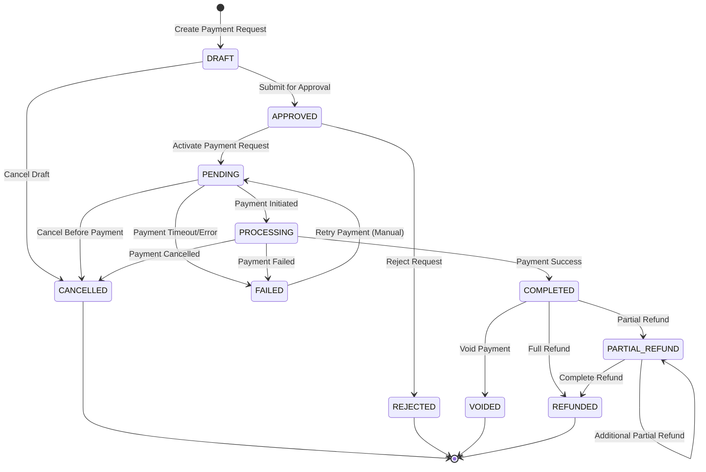

# Payment Request State Machine Documentation

## Document Information

- **Version**: 1.0
- **Last Updated**: January 1, 2025
- **Document Type**: Technical Documentation
- **Related**: payment-prd.md

---

## Table of Contents

1. [Overview](#overview)
2. [State Definitions](#state-definitions)
3. [State Transition Diagram](#state-transition-diagram)
4. [Transition Rules](#transition-rules)

---

## Overview

The Payment Request State Machine manages the lifecycle of payment requests from creation to completion. It ensures proper state transitions, maintains data integrity, and enforces business rules throughout the payment process.

### Key Characteristics

- **11 distinct states** covering the complete payment lifecycle
- **Unidirectional transitions** with specific business rules
- **Audit trail** for all state changes
- **Validation logic** preventing invalid transitions
- **Final state detection** for completed workflows

---

## State Definitions

### Initial States

#### DRAFT

- **Description**: Initial state, not yet active
- **Purpose**: Payment request is being created/edited
- **Characteristics**:
  - Can be modified freely
  - Not visible to payers
  - No payment token generated
  - Can be deleted

#### APPROVED

- **Description**: Payment request has been approved
- **Purpose**: Administrative approval before activation
- **Characteristics**:
  - Ready for activation
  - Cannot be modified without re-approval
  - Awaiting transition to PENDING

### Active States

#### PENDING

- **Description**: Active, awaiting payment
- **Purpose**: Payment request is live and accepting payments
- **Characteristics**:
  - Payment link is active
  - Can accept payment transactions
  - Has expiration date
  - Visible to payers

#### PROCESSING

- **Description**: Payment received, being processed
- **Purpose**: Payment transaction is being validated/processed
- **Characteristics**:
  - Payment attempt in progress
  - Temporary state during transaction processing
  - Cannot accept new payments
  - Automatic transition based on transaction result

### Success States

#### COMPLETED

- **Description**: Successfully completed
- **Purpose**: Payment successfully received and processed
- **Characteristics**:
  - Payment fully received
  - Can be voided or refunded
  - Final successful state
  - Triggers completion workflows

### Failure States

#### FAILED

- **Description**: Payment failed
- **Purpose**: Payment attempt failed permanently
- **Characteristics**:
  - All payment attempts exhausted
  - Cannot accept new payments
  - May be reset to PENDING for retry
  - Requires manual intervention

#### REJECTED

- **Description**: Payment request has been rejected
- **Purpose**: Administrative rejection of payment request
- **Characteristics**:
  - Cannot be activated
  - Requires approval to proceed
  - Final rejection state

### Cancellation States

#### CANCELLED

- **Description**: Cancelled by user/admin before payment
- **Purpose**: Payment request terminated before completion
- **Characteristics**:
  - No payment received
  - Cannot be reactivated
  - Final cancellation state
  - May have associated cancellation reason

### Post-Payment States

#### VOIDED

- **Description**: Voided after successful payment
- **Purpose**: Payment reversed/cancelled after completion
- **Characteristics**:
  - Original payment was successful
  - Payment has been reversed
  - Cannot be further modified
  - Final void state

#### REFUNDED

- **Description**: Full refund processed
- **Purpose**: Complete refund of successful payment
- **Characteristics**:
  - Full amount refunded
  - Cannot be further refunded
  - Final refund state
  - Maintains refund audit trail

#### PARTIAL_REFUND

- **Description**: Partial refund processed
- **Purpose**: Partial amount refunded, may allow additional refunds
- **Characteristics**:
  - Partial amount refunded
  - May allow additional partial refunds
  - Can transition to REFUNDED for full refund
  - Maintains refund history

---

## State Transition Diagram

---

## Transition Rules

### Valid Transitions

| From State     | To State       | Trigger              | Conditions                   |
| -------------- | -------------- | -------------------- | ---------------------------- |
| DRAFT          | APPROVED       | Manual approval      | Valid payment request data   |
| DRAFT          | CANCELLED      | Manual cancellation  | Any time                     |
| APPROVED       | PENDING        | Activation           | Approval completed           |
| APPROVED       | REJECTED       | Manual rejection     | Administrative decision      |
| PENDING        | PROCESSING     | Payment initiation   | Valid payment attempt        |
| PENDING        | CANCELLED      | Manual cancellation  | Before payment received      |
| PENDING        | FAILED         | Payment failure      | All retry attempts exhausted |
| PROCESSING     | COMPLETED      | Payment success      | Transaction successful       |
| PROCESSING     | FAILED         | Payment failure      | Transaction failed           |
| PROCESSING     | CANCELLED      | Payment cancellation | Transaction cancelled        |
| COMPLETED      | VOIDED         | Void operation       | Within void window           |
| COMPLETED      | REFUNDED       | Full refund          | Refund request               |
| COMPLETED      | PARTIAL_REFUND | Partial refund       | Partial refund request       |
| PARTIAL_REFUND | REFUNDED       | Complete refund      | Remaining amount refunded    |
| PARTIAL_REFUND | PARTIAL_REFUND | Additional refund    | Additional partial refund    |
| FAILED         | PENDING        | Manual retry         | Administrative reset         |

### Invalid Transitions

- **No backward transitions** except FAILED → PENDING (manual retry)
- **No transitions from final states** (CANCELLED, REJECTED, VOIDED, REFUNDED)
- **No direct transitions** from DRAFT to PENDING (must go through APPROVED)
- **No transitions from PROCESSING** except to final states

---
